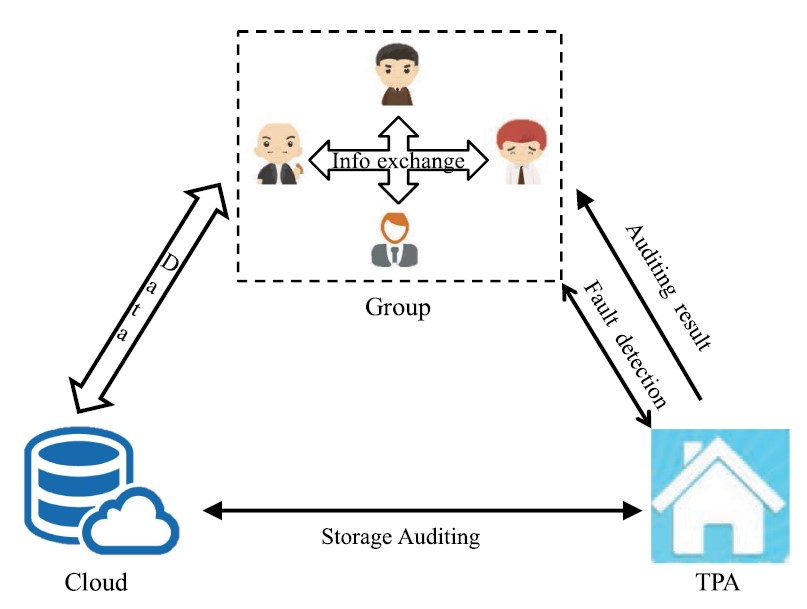

# SBIBD_impl
A sample implementation scenario based on IEEE paper "Block Design-Based Key Agreement for Group Data Sharing in Cloud Computing".

## System Architecture 

This project roughly follows the system outline shown below.[^1]  

## References/Footnotes 

[^1]: Shen, Jian, et al. “Block design-based key agreement for Group Data Sharing in cloud computing.” IEEE Transactions on Dependable and Secure Computing, vol. 16, no. 6, 1 Nov. 2019, pp. 996–1010, https://doi.org/10.1109/tdsc.2017.2725953.